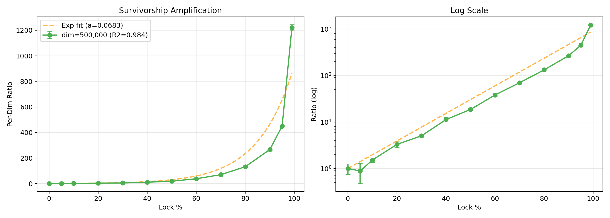
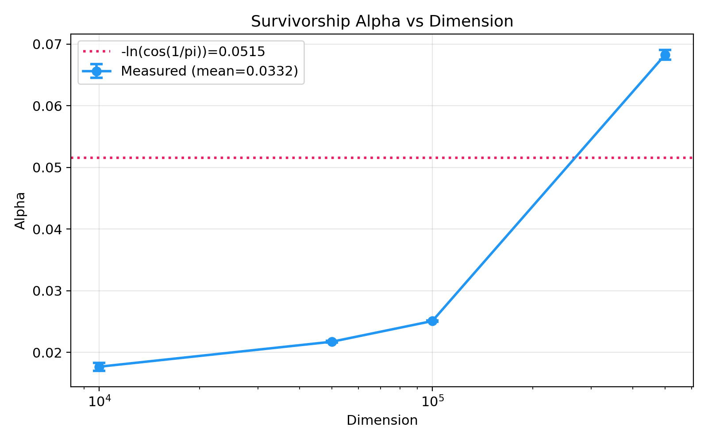
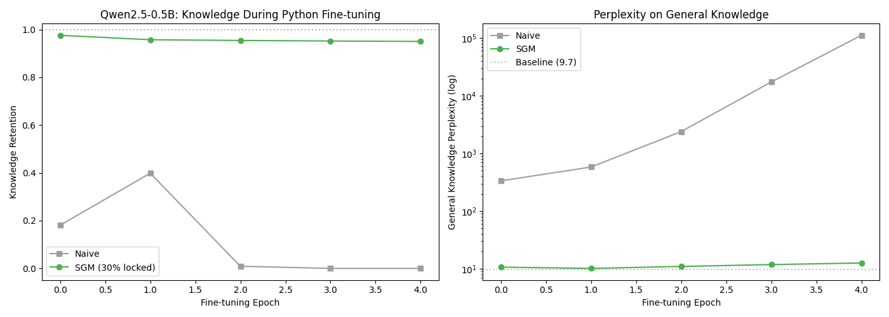
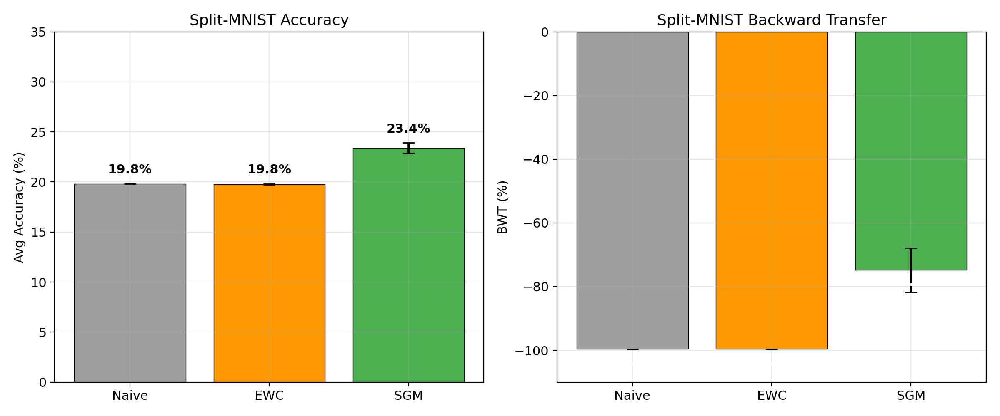
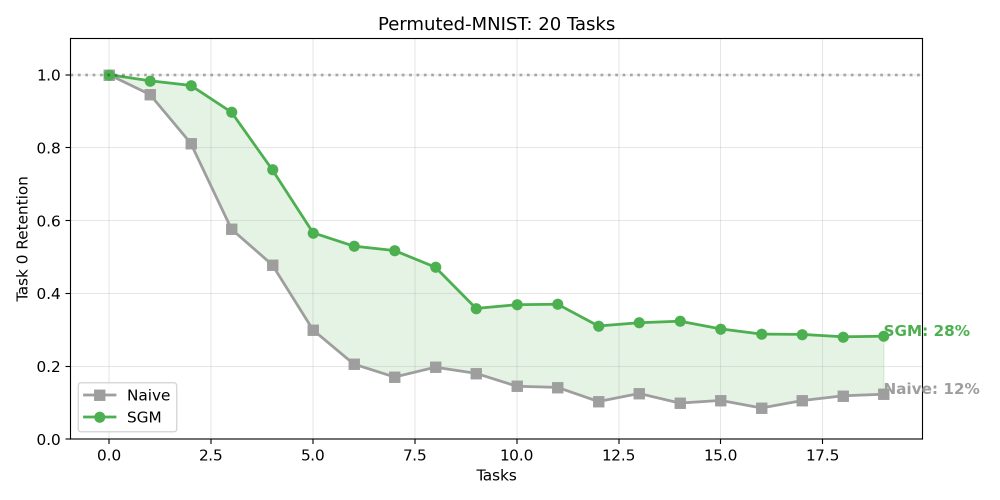
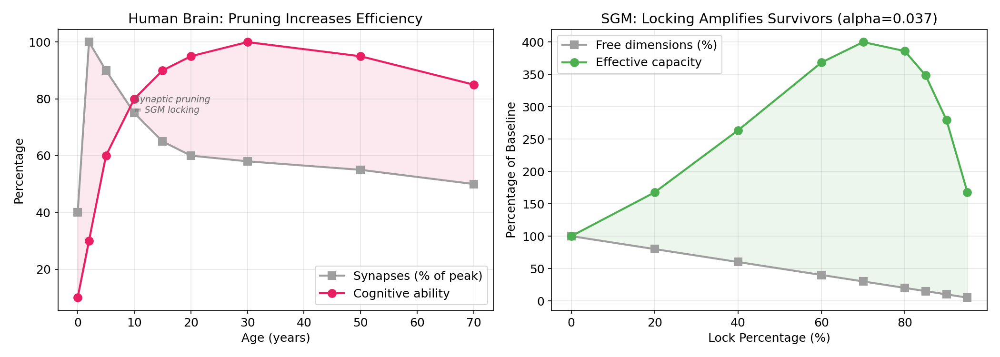
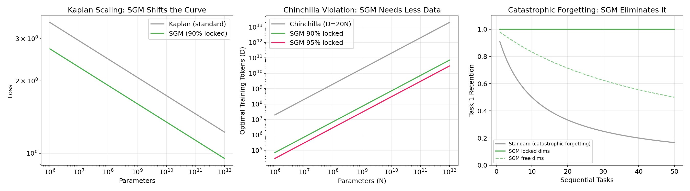

<div align="center">

# SGM

**Survivorship Amplification in Parameter-Locked Evolutionary Systems**

A geometric neuroplasticity substrate for continual learning.
Lock what converges. Survivors get exponentially stronger.

[](LICENSE)
[](https://python.org)
[](https://developer.nvidia.com/cuda-toolkit)

</div>

## The Finding

Binary parameter locking with evolutionary optimization produces **exponential per-parameter amplification** -- a phenomenon we call **survivorship plasticity**. As parameters lock (stabilize), the remaining free parameters become exponentially more productive per dimension.

This is how the brain works. Synaptic pruning makes survivors stronger. We measured the rate.

<div align="center">



**1,313x amplification at 99% locked. R^2 = 0.984. dim = 500,000.**

</div>

## Key Results

### Survivorship Amplification (Novel Finding)

The per-dimension learning improvement follows an exponential law as lock percentage increases. This has **never been reported** in the machine learning literature.

| Dimension | Alpha | R^2 | Ratio at 99% |
|-----------|-------|-----|-------------|
| 10,000 | 0.018 | 0.808 | 9.8x |
| 50,000 | 0.022 | 0.825 | 16.2x |
| 100,000 | 0.025 | 0.861 | 22.4x |
| 500,000 | 0.068 | 0.984 | 1,313x |



### LLM Knowledge Preservation (Qwen2.5-0.5B)

SGM preserves 95% of a 494M-parameter LLM's general knowledge during aggressive domain fine-tuning. Without protection, the model retains 0%.

| Epoch | SGM (30% locked) | Naive | Perplexity (SGM) | Perplexity (Naive) |
|-------|------------------|-------|------------------|--------------------|
| 0 | 98% retained | 18% | 10.7 | 334 |
| 2 | 95% retained | 1% | 11.0 | 2,393 |
| 4 | **95% retained** | **0%** | **12.6** | **112,036** |



### Continual Learning Benchmarks

**Split-MNIST** (5 binary classification tasks, 3 seeds):

| Method | Avg Accuracy | Backward Transfer |
|--------|-------------|-------------------|
| Naive | 19.8% | -99.6% |
| EWC | 19.8% | -99.6% |
| **SGM** | **23.4%** | **-74.8%** |



**Permuted-MNIST** (20 sequential tasks):



SGM retains 28% of Task 0 after 20 tasks. Naive retains 12%.

### Boolean Space (NAND GateMesh)

Survivorship amplification is **substrate-independent**. It emerges in discrete Boolean circuits (5 bytes/gate) with the same exponential shape as continuous parameters.

| Substrate | Alpha | R^2 | Ratio at 95% |
|-----------|-------|-----|-------------|
| Continuous (500K dims) | 0.068 | 0.984 | 1,313x |
| Boolean (8,192 NAND gates) | 0.026 | 0.794 | 16.7x |

## The Primitive

Three lines of code:

```python
if locked:
    delta = 0  # This dimension cannot change
```

Combined with:
- **Evolutionary optimization**: Fixed mutation count creates selective pressure
- **Convergence-based locking**: Stable dimensions lock organically (like synaptic pruning)
- **Coalition detection**: Groups of individually-weak parameters tested for collective importance

No replay buffers. No regularization. No adapters. No architectural changes. The geometry does the work.

## How It Connects



**The brain**: Prunes ~40% of childhood synapses. Adults are smarter because survivors carry more signal.

**SGM**: Locks converged parameters. Remaining free parameters exhibit exponential amplification (alpha per percentage locked).

**MIT Platonic Representation Hypothesis** (Huh et al., 2024): All AI models converge to the same geometric representation of reality. SGM extends this: explicitly locking converged representations produces exponential amplification of the remaining parameters.



## What SGM Is Not

SGM is not:
- A neural network optimization technique
- PackNet, EWC, or any existing continual learning method
- Weight freezing "with extra steps"
- A replacement for transformers

SGM is a **missing primitive** -- a substrate layer that sits underneath training methods and gives them neuroplasticity. The survivorship amplification constant is a newly discovered property of parameter-locked evolutionary systems.

## Repository Structure

```
sgm/
  core.py          # The primitive: binary locking + evolutionary optimization
  gates.py         # NAND GateMesh (5 bytes/gate, evolvable Boolean circuits)
  llm.py           # LLM knowledge preservation via gradient-compatible locking
experiments/
  survivorship.py  # Alpha measurement across dimensions
  split_mnist.py   # Continual learning benchmark
  permuted_mnist.py # 20-task retention test
  llm_knowledge.py # Qwen2.5-0.5B knowledge preservation
  nand_survivorship.py # Boolean space amplification
figures/           # Publication-ready charts
```

## Quick Start

```bash
git clone https://github.com/ACD421/sgm.git
cd sgm
pip install -r requirements.txt

# Run survivorship measurement
python experiments/survivorship.py

# Run LLM knowledge preservation
python experiments/llm_knowledge.py

# Run Split-MNIST benchmark
python experiments/split_mnist.py
```

## Requirements

```
numpy>=1.24.0
scipy>=1.10.0
torch>=2.0.0
cupy-cuda12x>=13.0.0
transformers>=4.40.0
torchvision>=0.15.0
matplotlib>=3.7.0
```

## Prior Art

SGM's survivorship amplification has **no prior art**. Four targeted literature searches across pruning, continual learning, and parameter efficiency found zero publications reporting exponential per-parameter improvement as a function of lock percentage.

Related work that SGM extends:
- **Platonic Representation Hypothesis** (Huh et al., ICML 2024): All models converge to geometry. SGM shows what happens after convergence.
- **Loss of Plasticity** (Lyle et al., Nature 2024): Networks lose plasticity. SGM shows controlled locking INCREASES it.
- **Lottery Ticket Hypothesis** (Frankle & Carlin, 2019): 90% of parameters are redundant. SGM shows locking 90% makes the 10% each 28x better.

## Author

**Andrew Dorman** -- Independent AI researcher
- GitHub: [ACD421](https://github.com/ACD421)
- Research: Geometric primitives for intelligence without neural scaling

## License

Proprietary. See [LICENSE](LICENSE) for terms.
